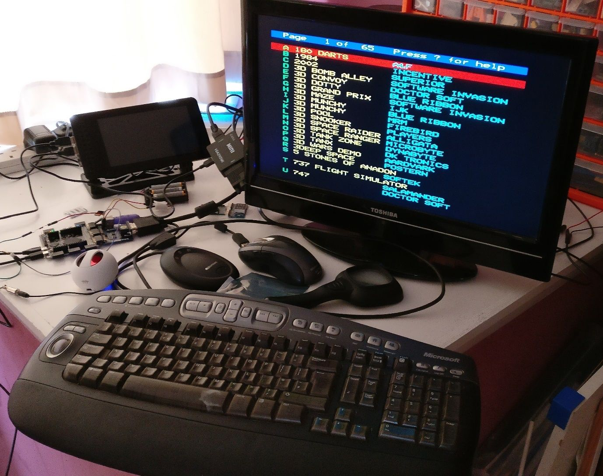
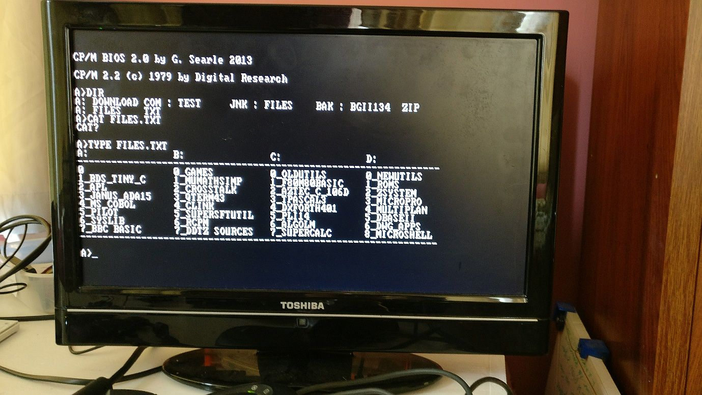

# Retro Computing

The BlackIce II with its SRAM, SD card reader, fast clock and plentiful Pmod sockets is particularly suited to emulating older computers.

Some of the implementations available on BlackIce II are:

* BBC Micro
* Acorn Atom
* Z80 CP/M
* Jupiter Ace
* Apple One

All these implementations use the Digital VGA Pmod and a VGA monitor, plus a Digilent PS/2 keyboard Pmod and a PS/2 keyboard.

Several of them require an SD card created for them to stores games and other programs.

## BBC Micro

The BBC Model B implementation for BlackIce II  is available at https://github.com/hoglet67/Ice40Beeb/releases/download/release_2/icebootbeeb_blackice2.zip.

It was written by David Banks (@hoglet67). Like several of his other implementations it has a custom version of iceboot and includes the STM32 firmware and the Ice40 bitstream in its binary.  The binary also contains the BBC B ROMs which are send to the Ice40 using SPI. So the standard iceboot software will not work.

You will need a Digilent VGA Pmod (or equivalent)  and a VGA monitor in PMOD 7/8/9/10 and a Digilent PS/2 Pmod and a 3.3v tolerant PS/2 keyboard in Pmod 12 (lower pins).

On pin 1 (right hand, top) of Pmod 11 you can attach a speaker for audio output.

Its binary is written to the STM32 flash memory using dfu-util, so the jumper must be removed from the Rpi header.

As the Beeb programs are on an SD card, you must format a FAT32 SD card and write https://github.com/hoglet67/Ice40Beeb/releases/download/release_1/BEEB.MMB.zip on to it. The card should be inserted and all the dip switches should be in the off (pull-up) position as otherwise the SD card access will not work.

Switch SW4 is dual function:

- a short press emulates a power up reset
- a long press toggles the video output between VGA and SRGB

The LEDs are:

- LED1 (blue) - indicates SRGB mode enabled
- LED2 (green) - indicates the BREAK key is pressed
- LED3 (orange) - indicates shift lock is active
- LED4 (red) - indicates caps lock is active

The dfu-util command is:

	sudo dfu-util -d 0483:df11 -s 0x08000000  -D iceboot_blackice2_mux_enabled_leds.raw --alt 0 -t 1024

When you have finished using the BBC Model B emulation you can use dfu-util to restore iceboot and erase the flash memory, and replace the jumper in the RPi header, if required.

## Acorn Atom

The Acorn Atom emulation is another of David Bank’s programs. Like the BBC Micro it has a binary that contains custom firmware and an Ice40 bitstream. And again, it uses the SD card, so the sliders must be in the off position.

The set-up for VGA monitor, PS/2 keyboard and audio is the same as the BBC Micro, but the way the SD card is created and used is different.

The software is available at https://github.com/hoglet67/Ice40Atom/releases/download/release_3/ice40atom_20180117_1707.zip

This needs to be written to flash memory by dfu-util.

The software archive is available at https://github.com/hoglet67/AtomSoftwareArchive/releases/download/V10/AtomSoftwareArchive_20180225_1154_V10_SDDOS2.zip

You need to write this as a raw image to ad SD card by:

	dd if=archive.img of=/dev/sdxxx

where sdxxx is SD card drive.

## Z80 CP/M

This is another David Banks port. It again includes custom firmware and the combined binary needs to be written to flash memory with dfu-util.

The latest release does not support BlackIce II, so it needs to be built with the release.sh script at https://github.com/hoglet67/Ice40CPMZ80.

The SD card image is available at http://obsolescence.wixsite.com/obsolescence/multicomp-fpga-cpm-demo-disk.

## Jupiter ACE

And another David Banks port.

The Jupiter Ace was a Forth machine.

This port is a simpler one that does not require custom firmware It can be build using the build.sh file at https://github.com/hoglet67/Ice40JupiterAce/tree/master/blackice2.

## Apple One

This implementation of the Apple One is by Alan Garfield.

It is available at https://github.com/alangarf/apple-one.

## EDSAC

There is an [emulation of the 1949 Cambridge University computer, EDSAC][1], that runs on BlackIce. You send it the EDSAC assembler program in text format on /dev/ttyUSB0 at 9600 baud, and it replies with the results. The test program calculates the squares on the first one hundred integers. A [tutorial on EDSAC][2] is available from Warwick University and a [poster][] from Cambridge University. The BlackIce program was developed by Richard Miller based on work by Bill Purvis. It was produced for the [EDSAC Challenge event][3].

[1]:									https://github.com/millerresearch/chiphack/tree/master/minimal-edsac
[2]:									https://www.dcs.warwick.ac.uk/~edsac/Software/EdsacTG.pdf
[poster]:								http://www.cl.cam.ac.uk/~mr10/edsacposter.pdf
[3]:									https://nanode0000.wordpress.com/2017/04/23/an-edsac-simulator-using-simpl/
